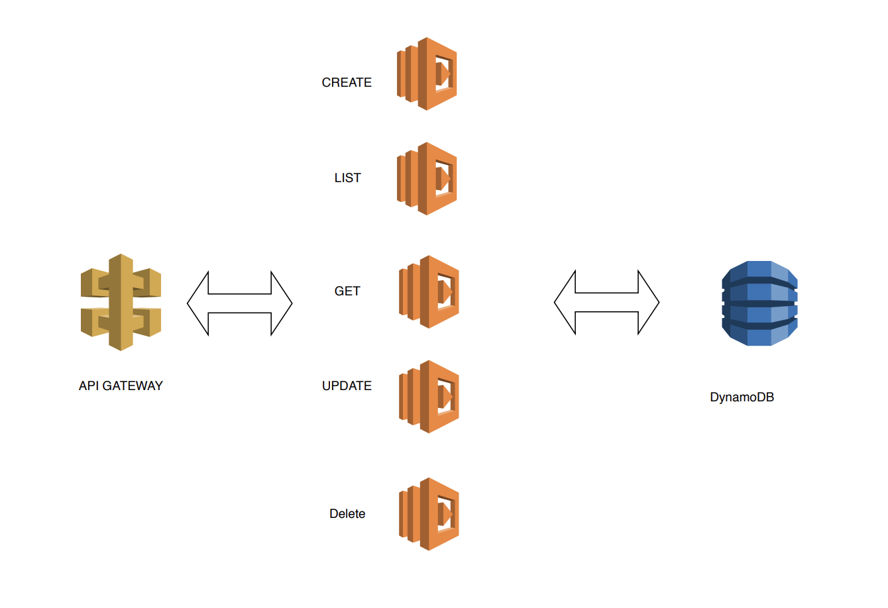

# Serverless REST API

This example demonstrates how to setup a [RESTful Web Services](https://en.wikipedia.org/wiki/Representational_state_transfer#Applied_to_web_services) and perform the following operations on a dynamoDB database: 
* Create
* List
* Get
* Update
* Delete


## Architecture



## AWS Techs used:
1. [AWS API Gateway](https://aws.amazon.com/api-gateway/)
2. [AWS Lambda](https://aws.amazon.com/lambda/)
3. [AWS DynamoDB](https://aws.amazon.com/dynamodb/)
## Folder Structure

```
.
├── README.md
├── package-lock.json
├── package.json
├── serverless.yml
└── todos
    ├── create.js
    ├── delete.js
    ├── get.js
    ├── list.js
    └── update.js

```

As can be seen from the folder structure. This service has a separate directory for all the todo operations. Exactly one file exists for each service.

e.g. `todos/delete.js` to delete and so on. 

In each of these files there is exactly one function which is directly attached to `module.exports`.

The idea behind the `todos` directory is that in case you want to create a service containing multiple resources e.g. users, notes, comments you could do so in the same service. 

## Use-cases

- Serverless API for a Web Application
- Serverless API for a Mobile Application

## Setup

Install the required packages first by running the following command:

```bash
npm install
```

## Deploy

In order to deploy the endpoint simply run

```bash
serverless deploy
or 
sls deploy -v
```

## Usage

You can create, retrieve, update, or delete todos with the following commands:

### Create a Todo

```bash
curl -X POST https://XXXXXXX.execute-api.us-east-1.amazonaws.com/dev/todos --data '{ "text": "Learn Serverless" }'
```

Example Result:
```bash
{"text":"Learn Serverless","id":"ee6490d0-aa81-11e6-9ede-afdfa051af86","createdAt":1479138570824,"checked":false,"updatedAt":1479138570824}%
```

### List all Todos

```bash
curl https://XXXXXXX.execute-api.us-east-1.amazonaws.com/dev/todos
```

Example output:
```bash
[{"text":"Deploy my first service","id":"ac90fe80-aa83-11e6-9ede-afdfa051af86","checked":true,"updatedAt":1479139961304},{"text":"Learn Serverless","id":"20679390-aa85-11e6-9ede-afdfa051af86","createdAt":1479139943241,"checked":false,"updatedAt":1479139943241}]%
```

### Get one Todo

```bash
# Replace the <id> part with a real id from your todos table
curl https://XXXXXXX.execute-api.us-east-1.amazonaws.com/dev/todos/<id>
```

Example Result:
```bash
{"text":"Learn Serverless","id":"ee6490d0-aa81-11e6-9ede-afdfa051af86","createdAt":1479138570824,"checked":false,"updatedAt":1479138570824}%
```

### Update a Todo

```bash
# Replace the <id> part with a real id from your todos table
curl -X PUT https://XXXXXXX.execute-api.us-east-1.amazonaws.com/dev/todos/<id> --data '{ "text": "Learn Serverless", "checked": true }'
```

Example Result:
```bash
{"text":"Learn Serverless","id":"ee6490d0-aa81-11e6-9ede-afdfa051af86","createdAt":1479138570824,"checked":true,"updatedAt":1479138570824}%
```

### Delete a Todo

```bash
# Replace the <id> part with a real id from your todos table
curl -X DELETE https://XXXXXXX.execute-api.us-east-1.amazonaws.com/dev/todos/<id>
```

No output

## Scaling

### AWS Lambda

By default, AWS Lambda limits the total concurrent executions across all functions within a given region to 100. The default limit is a safety limit that protects you from costs due to potential runaway or recursive functions during initial development and testing. To increase this limit above the default, follow the steps in [To request a limit increase for concurrent executions](http://docs.aws.amazon.com/lambda/latest/dg/concurrent-executions.html#increase-concurrent-executions-limit).

### DynamoDB

When you create a table, you specify how much provisioned throughput capacity you want to reserve for reads and writes. DynamoDB will reserve the necessary resources to meet your throughput needs while ensuring consistent, low-latency performance. You can change the provisioned throughput and increasing or decreasing capacity as needed.

This is can be done via settings in the `serverless.yml`.

```yaml
  ProvisionedThroughput:
    ReadCapacityUnits: 1
    WriteCapacityUnits: 1
```

In case you expect a lot of traffic fluctuation we recommend to checkout this guide on how to auto scale DynamoDB [https://aws.amazon.com/blogs/aws/auto-scale-dynamodb-with-dynamic-dynamodb/](https://aws.amazon.com/blogs/aws/auto-scale-dynamodb-with-dynamic-dynamodb/)

### Credits: 
* [AWS Documentation](https://aws.amazon.com/documentation/)
* [AWS Lambda Documentation](https://docs.aws.amazon.com/lambda/latest/dg/welcome.html)
* [AWS Documentation on Github](https://github.com/awsdocs)
* [AWS Doc SDK Examples](https://github.com/awsdocs/aws-doc-sdk-examples)
* [AWS SDK for JavaScript examples](https://github.com/awsdocs/aws-doc-sdk-examples/tree/master/javascript)